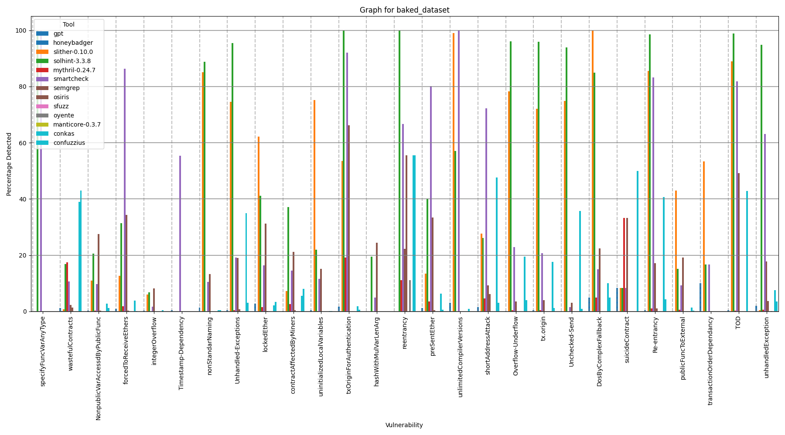

# Complete Experiment Report
**Disclaimer**: The Complete Experiment required several more than o month to finalize and was undertaken on a system with 20 cores, 32 GB RAM, and 200 GB disk space.

For our complete experiment we first included several hundred thousand smart contracts sourced from other works, which, in turn, collected them directly from the Ethereum mainnet. Namely, we included [DISL](https://huggingface.co/datasets/ASSERT-KTH/DISL), [Smart Contract Sanctuary](https://github.com/tintinweb/smart-contract-sanctuary)'s Solidity source code contracts, and [HuangGai](https://github.com/xf97/HuangGai)'s unlabeled datasets. This resulted in a collection of over 300,000 unique `.sol` files. 

Due to the sheer size of our dataset and the insertion process's intensive computational requirements (even with multi-threading), we decided to further reduce its size by only selecting the first sixth os the contracts sorted in alphabetical order. The end result comprised of approximately 50,000 entries.

We then executed both bug injection tools supported by Vullab, `SolidiFI` and `HuangGai`, with 20 threads and a 1 second (approximately 0.017 minutes) timeout for HuangGai's containers. Note that this process took 18 days to finish. The command utilized was the following

```
bash vullab.sh -t 20 -s -u 0.017
```

The resulting dataset is `baked_dataset_complete_experiment`. If this experiment is to be reproduced, this step is already done. Hence, only copy the contents of `dataset/baked_dataset_complete_experiment` to `dataset/baked_dataset` and follow on!

We then executed VulLab's analysis module, comprised of `SmartBugs2`' 14 tools with support of Solidity source code. For this step, we configured our tool to consider only the 1000 contracts from each inserted bug in our dataset which presented the most complex code, which it measures by counting the number of functional lines. GPT was also included, but its configuration further decreased the number of analyzed contracts to only 100 per vulnerability due to cost constrains. The model selected was `gpt-4o-mini`. This process took approximately 35 days to complete.

The command for executing SmartBugs was:

```
bash vullab.sh -t <threads> -a 1000 -m 1
```

And the command for executing the gpt-analyzer was:

```
bash vullab.sh -t <threads> -g 100 gpt-4o-mini -m 1
```

If trying to reproduce, we recommend using at least 20 cores (threads) for both.

After executing, the output should be as follows:

<p align="center">
  
</p>

We would like to point out that, in the image above, the vulnerability names are still not mapped to SCWE and retain their original names (given by each vulnerability insertion tool). This is due to the fact that this experiment was undertaken during VulLab's development, in a moment prior to the implementation of VulLabs's mapping mechanism. However, the graph should, besides the names, be approximately the same.
