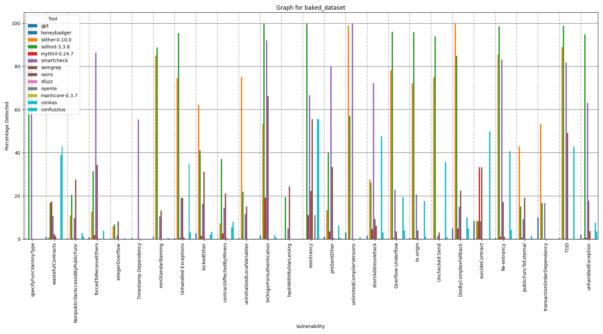

<div style="text-align: justify"> 

# VulLab

We present VulLab, a validation framework for vulnerability detection tools with support to Solidity source code. Our application enables users to add vulnerabilities to a collection of smart contracts, extract their respective labels and readily use them as a benchmark for several bug detector. This repository is related to the paper "*Building a Labeled Smart Contract Dataset for Evaluating Vulnerability Detection Tools’ Effectiveness*", currently under evaluation for publishing in SBSeg2025's Tools Session (Salão de Ferramentas). The work's abstract goes as follows:

*In recent years, surveys on vulnerability detection tools for
Solidity-based smart contracts have shown that many of them display poor
capabilities. One of the causes for such deficiencies is the absence of quality benchmarking datasets, where bugs typically found in smart contracts are present in quantity and accurately labeled. VulLab’s main aim is to help tackle this issue as a framework that incorporates both, state-of-the-art vulnerability insertion and vulnerability detection tools. Such capabilities empower users to seamlessly generate benchmark capable datasets from collected contracts and employ them to validate novel analysis tool and obtain an accurate comparison with current state-of-the-art solutions. The framework was able to, from 50 smart contracts collected from the Ethereum mainnet, generate an annotated dataset more than 300 entries which included 20 unique vulnerabilities, and use them to compare 14 analysis tools in approximately 24 hours. VulLab is open-source and is available at https://github.com/lsRyan/vullab.git.*

## Table of contents
- [VulLab](#vullab)
  - [Table of contents](#table-of-contents)
  - [Readme structure](#readme-structure)
  - [Seals to be Considered](#seals-to-be-considered)
  - [Basic Information](#basic-information)
  - [Dependencies](#dependencies)
  - [Security Concerns](#security-concerns)
  - [Installation](#installation)
    - [Using Miniconda (recommended)](#using-miniconda-recommended)
    - [Using pip (not recommended)](#using-pip-not-recommended)
  - [Usage](#usage)
    - [Command line interface](#command-line-interface)
    - [Options](#options)
  - [Test and Experiments](#test-and-experiments)
    - [Before running the experiments](#before-running-the-experiments)
    - [Smoke test (Minimum test)](#smoke-test-minimum-test)
    - [Reduced Experiment](#reduced-experiment)
      - [Claim 1](#claim-1)
      - [Claim 2](#claim-2)
    - [Complete Experiment](#complete-experiment)
  - [Demo (In portuguese)](#demo-in-portuguese)
  - [License](#license)

## Readme structure
This section offers an overview of the contents contemplated by each section of the readme. You can easily navigate between sections by accessing the [Table of contents](#table-of-contents) above. The organization of this document is as follows:

- **Seals do be considered**: Quality Seals claimed
- **Basic Information**: Introduction of VulLab's capabilities and architecture
- **Dependencies**: Presentation of the dependencies needed to execute VulLab
- **Security Concerns**: Disclaimer about the security implications of executing VulLab
- **Installation**: Step-by-step guide of how to install VulLab
- **Usage**: Manual of how to use each of VulLab's functionalities
- **Test and Experiments**: Step-by-step guide for the execution of a minimum functional test and the experiments presented in the paper
- **Demo**: Video with an example of executing VulLab in the provided virtual machine
- **License**: Project license

## Seals to be Considered
We would like to request the evaluation of all of the Quality Seals, namely Open Source Artifact (SeloD), Functional Artefact (SeloF), Sustainable Artefact (SeloS), and Reproducible Experiments (SeloR).

## Basic Information
VulLab is a vulnerability detection tools validation framework specialized in Solidity-based smart contracts which combines three important state-of-the-art research works. Its implementation brings together bug insertion capabilities and vulnerability detectors automatic execution and benchmarking. The main objective of our application is to empower developers to easily obtain and use an annotated dataset in order to test their detection tools still in development and rapidly obtain a comparison between the novel solution and te current state-of-the-art capabilities.

For the addition of bugs to collected smart contracts, VulLab is powered by two of the foremost insertion applications for Solidity source code: [SolidiFI](https://github.com/DependableSystemsLab/SolidiFI) and [HuangGai](https://github.com/xf97/HuangGai). The supported versions for them are `pragma version 0.5.0^` and `pragma version 0.7.0^` respectively. VulLab enhances these tools' usability by executing them in a seamless automatic multi-threading mode. Besides, the inserted contracts and labels are standardized to SolidiFI's robust CSV format and directly matched with the [Smart Contract Vulnerability Weakness Enumeration (SCWE)](https://scs.owasp.org/SCWE/) entry deemed closest to each of them. In the cases were no SCWE match was deemed reasonable, we defined our own extension to the enumeration, named SCWEX. The integration of insertion mechanisms was specifically designed with modularity in mind, enabling an easy way to add new tools to this framework as they are developed.

As for the execution of state-of-the-art vulnerability analysis tools, our framework employs [SmartBugs](https://github.com/smartbugs/smartbugs), which enables the parallelization of containerized tools. Its modularity makes it a perfect choice for VulLab, as it can be easily extended by following [the extension tutorial](https://github.com/smartbugs/smartbugs/wiki/Adding-new-analysis-tools) in its [wiki](https://github.com/smartbugs/smartbugs/wiki) page, thus enabling developers to add their newly developed tool to effortlessly obtain a comparison with other stat-of-the-art analyzers. The results obtained by running the analysis are automatically compiled into `results/summary.csv`, which is used for comparison with the vulnerability labels.

Besides `SmartBugs2`, VulLab's vulnerability analysis module also includes a simple GPT-based LLM detection solution. It was implemented as an API call which uses a specially crafted system prompt instructing the model to act as an analysis tool. Importantly, in context learning was employed to ensure that the adopted report standard, Sarif 2.1.0, is followed and that the detected tools are named by the SCWE standard.

The image bellow offers an overview of the described process:

<p align="center">
  
</p>

An in-depth explanation of Vullab's implementation can be found in the [Technical Details page](docs/Technical_Details.md).


## Dependencies
VulLab was made for Linux systems and was not tested in Windows or MacOS. Its main dependencies are `Docker` and `Python`.

For installing `Docker`'s latest version follow [Docker's installation tutorial](https://docs.docker.com/engine/install/ubuntu/). Make sure to add your user to `Docker`'s group to allow VulLab to use it. You can achieve that by executing 

```
sudo usermod -a -G docker $USER
```

Please refer to `Docker`'s [documentation](https://docs.docker.com/manuals/) for more information.

We recommend using `python version 3.13`. Make sure you have this version installed or get it by typing

```
apt-get install python3.13
```

`SmartBugs` is also needed to execute the analysis of smart contracts by vulnerability detection tools. Note that Smartbugs should be installed **after** cloning vullab's repository. To install the tool, clone its source into VulLab's directory by executing

```
git clone https://github.com/smartbugs/smartbugs
```

Then, install the provided virtual environment by typing

```
cd smartbugs
install/setup-venv.sh
```

For more information on `SmartBugs` installation please refer to its [installation tutorial](https://github.com/smartbugs/smartbugs/blob/master/doc/installation.md). The repository's [wiki](https://github.com/smartbugs/smartbugs/wiki) page also contains helpful information regarding the tool's installation, usage and extension.

VulLab requires several `pip` libraries to work. The installation steps should automatically install all of them. For the specific libraries utilized and their respective versions please refer to the `vullab_env.yml` or `requirements.txt` files.

## Security Concerns
There are no relevant safety and security concerns in regard to the installation and usage of VulLab.

## Installation
You can download a Virtual Machine (~70Gb) that already has VulLab and all its dependencies installed by clicking the button below. It is the same one used in the [Demo](#demo-in-portuguese)! The provided VM also includes everything necessary to conduct all tests and experiments described in the [Test and Experiments](#test-and-experiments) section. We recommend trying this option before opting for the manual installation.

[![Button]][VM_Link]

[Button]: https://img.shields.io/badge/Download_VM-37a779?style=for-the-badge
[VM_Link]: https://1drv.ms/u/c/b52313abe04135e0/EZSJDVFYoShJoiYb9D2qC98BEHNOBcKp-5lM5g0ZM6Amew?e=VW3Gnh

For manually installing VUlLab we offer two alternatives: one requiring `miniconda`, a free environment managing tool, and another which only requires a system with `python`.

Regardless of the installation method, the first step is to clone this repository. To achieve that execute the following line in the directory you wish VulLab to be located

```
git clone https://github.com/lsRyan/vullab.git
```

Then enter VulLab's working directory by executing

```
cd vullab
```

### Using Miniconda (recommended)
This alternative utilizes the provided environment provided in file `vullab_env.yml`. Its usage requires `miniconda`, which can be obtained by following [miniconda's installation tutorial](https://www.anaconda.com/docs/getting-started/miniconda/install). Once `miniconda` is installed, import the provided environment by executing

```
conda env create --file vullab_env.yml
```

To access the newly created environment just type

```
conda activate vullab
```

### Using pip (not recommended)
Alternatively you can install all the requirements manually in a virtual environment of your choice or in your main system. Before choosing this option we invite you to reconsider using `miniconda` as it enables you to use the provided specifically configured environment for VulLab, thus reducing the possibility of any issues.

First, make sure `pip` is installed by executing

```
python -m ensurepip --upgrade
```

Then, install VulLab's dependencies in your environment by typing

```
pip install -r requirements.txt
```

## Usage

VulLab can be utilized using the command line interface developed. It enables an easy way to execute each of the included tools, either independently or with one another, with the desired configuration.

### Command line interface
```
vullab.sh [--threads THREADS] [--cpus CPUS]
          [--solidifi] [--huanggai TIMEOUT]
          [--analyze QUANTITY] [--gpt QUANTITY MODEL] 
          [--match-window MATCH_WINDOW] [--build] 
          [--help]
```

### Options
`--threads THREADS`, `-t THREADS` Configures how many threads will run simultaneously during insertion and detection phases of the execution. Set as 1 by default, which means sequential execution.

`--cpus CPUS`, `-c CPUS` Configures how many CPUs will be assigned to each process. As each thread runs as a container, this setting means how many cpu power each container will receive. Set as 1 by default.

`--solidifi`, `-s` Executes SolidiFi in all of the `.sol` files located in `\dataset\raw_dataset`. The tool will insert as many vulnerabilities as it can in all of the contracts it finds suitable. The inserted contracts will be located at `\dataset\baked_dataset\*\smart_contracts` and the labels will be located in `\dataset\baked_dataset\*\labels`, where `*` represents a directory with the name of each supported vulnerability.

`--huanggai TIMEOUT`, `-u TIMEOUT` Executes HuangGai in all of the `.sol` files located in `\dataset\raw_dataset`. The inserted contracts will be located at `\dataset\baked_dataset\*\smart_contracts` and the labels will be located in `\dataset\baked_dataset\*\labels`, where `*` represents a directory with the name of each supported vulnerability. The optional configuration TIMEOUT corresponds to the timeout of each HuangGai container, which is set as 0.5 minutes by default.

`--analyze QUANTITY`, `-a QUANTITY` Executes `SmartBugs` in all of the contracts located in `\dataset\baked_dataset\*\smart_contracts`. Note that, despite supporting several other detection tools, only [confuzzius](https://github.com/christoftorres/ConFuzzius), [conkas](https://github.com/smartbugs/conkas), [honeybadger](https://github.com/christoftorres/HoneyBadger), [maian](https://github.com/smartbugs/MAIAN), [manticore](https://github.com/trailofbits/manticore), [mythril](https://github.com/ConsenSys/mythril), [osiris](https://github.com/christoftorres/Osiris), [oyente](https://github.com/smartbugs/oyente), [securify](https://github.com/eth-sri/securify), [semgrep](https://github.com/Decurity/semgrep-smart-contracts), [sfuzz](https://github.com/duytai/sFuzz), [slither](https://github.com/crytic/slither), [smartcheck](https://github.com/smartdec/smartcheck) and [solhint](https://github.com/protofire/solhint), will be used. These tools are the ones that support Solidity source code. When the QUANTITY configuration number is set, it selectively executes the analysis tools on the specified number of the most complex smart contracts per vulnerability within the database. The complexity of each smart contract was determined by a straightforward metric: the count of functional lines of code, which is set as `all` by default.

`--gpt QUANTITY MODEL`, `-g QUANTITY MODEL` **Note that GPT's API is paid!** Executes `GPT` with a pre-determined system prompt directing the model to behave as a state-of-the-art smart contract vulnerability detection tool. The target are all `.sol` files located in `\dataset\raw_dataset`. The results obtained will be compiled in the `results/MODEL` repository. When the QUANTITY configuration number is set, it selectively executes the analysis tools on the specified number of the most complex smart contracts per vulnerability within the database. Set as "all" by default. The MODEL configuration enables the selection of any of the available models. Set as gpt-4o-mini as default. If this option is present the results will automatically be compiled in the file `results\summary.csv` and will be graphically presented in `results\baked_dataset_results.png`.

`--match-window`, `-m` The match window is defined as how many lines more then the label definition is considered a 'hit' when comparing the detection results with the respective labels. For example, if a certain vulnerability is labeled as starting at line 10 and ending at line 20, a match window of 5 would mean that any detection of the correct vulnerability in the range of lines 5 through 25 will be considered a hit.

`--build`, `-b` Executes the building scripts, (re-)generating the CSV detection report and the accuracy statistics graph according to the labels.

`--help`, `-h` Will show the help menu. It contains a summary of the usage information.

## Test and Experiments
Firstly, the survey of vulnerability detection tools presented in our paper emerged from two distinct experimental phases:

- Reduced Experiment: This smaller-scale experiment generated the graph featured in the paper, aiming to demonstrate Vullab’s capabilities.
- Complete Experiment: This larger study included thousands of files, leading to insights on the performance of current state-of-the-art vulnerability detection tools (e.g., which tools excelled or fell short in specific vulnerabilities).

The Complete Experiment required several more than o month to finalize and was undertaken on a system with 20 cores, 32 GB RAM, and 200 GB disk space. Given these stringent requirements, **we request that the reduced experiment be considered for Seals' evaluation purposes, as its resource demands are impractical for standard assessments.**

To evaluate the primary functionalities of Vullab and replicate findings from our paper, we provide three datasets: `raw_dataset_5`, `raw_dataset_50`, and `baked_dataset_complete_experiment`. The latter is the principal dataset employed in our comprehensive experiments. As detailed below, its utilization demands significant computational resources and time. If, however, it is still deemed necessary to reproduce the larger experiment, the provided dataset is pre-labeled, i.e., they have already undergone the bug insertion process and should only take a portion of the time it took to obtain the final results.

The `raw_dataset_50` consists of fifty smart contracts, carefully curated from the raw dataset which utilized for obtaining `baked_dataset_complete_experiment`. Its main aim is to enable the user to observe all supported vulnerabilities for insertion, that is, they enable the insertion of at least one example of each of the 20 supported bugs. In contrast, `raw_dataset_5` is a subset containing only five entries, enabling a rapid "smoke test" to verify VulLab's core functionalities.

**Disclaimer**: It is important to note that large language models (LLMs) inherently exhibit probabilistic behavior, which may lead to variability in GPT-based results across different executions. Vullab’s GPT-based detection mechanism employs a manually crafted system prompt that explicitly outlines detection procedures and output instructions. No additional optimization steps were implemented to enhance consistency between model calls.

### Before running the experiments

- **If you are using the provided VM**, note that you will find VulLab's installation in `home/Documents`. Hence, you should follow the steps presented in the test and experiments below in that location. The `vullab` directory in the Desktop contain the **results obtained in the demo**. Importantly, if you get any error related to disk space (which should not happen) you can safely delete the Desktop directory.

- If you intend to use the GPT-analyzer, you should add your OpenAI API key in the .zrsh file present in `\home`. You can also only execute `SmartBugs2` you can omit `-g  <model>` from the commands.

- We strongly recommend watch the [demo](#demo-in-portuguese) before executing, as it presents a step-by-step execution of the [reduced experiment](#reduced-experiment).

### Smoke test (Minimum test)

The smoke test will enable the observation of all of Vullab's scripts integration and basic functionalities. To execute it, first copy all contents from the `dataset\raw_dataset_5` to the `dataset\raw_dataset` (you may need to manually delete the `.gitkeep` file in `dataset\raw_dataset`). With the command line open in the project's root directory execute

```
bash vullab.sh -t <threads> -s -u -a -g gpt-4o-mini
```

We recommend using 8 cores (threads).

After executing, the output should be as follows:

<p align="center">
  
</p>

### Reduced Experiment

To execute it, first copy all contents from `dataset\raw_dataset_50` to `dataset\raw_dataset` (you may need to manually delete the `.gitkeep` file in `dataset\raw_dataset`). With the command line open in the project's root directory execute:

```
bash vullab.sh -t <threads> -s -u 0.25 -a -g -m 3
```

We recommend using 8 cores (threads).

After executing, the output should be as follows:

<p align="center">
  
</p>

After the complete execution of the reduced experiment, we claim the following:

#### Claim 1

VulLab makes it possible to seamlessly create a high quality benchmark-capable dataset with 200+ entries in a somewhat reasonable amount of time (24 hours) only requiring a collection of collected contracts. It includes 20 different kinds of vulnerabilities, all mapped to SCWE, and have all their inserted vulnerabilities accurately labeled in clear, easy to read labels. Note that **only inserted vulnerabilities** are labeled. Other pre-existent bugs are not considered.

#### Claim 2

The generated dataset can be easily employed to benchmark several vulnerability detection tools and obtain an intuitive comparison graph. In addition, user can seamlessly add their newly developed vulnerability detection tools to test them against state-of-the-art solution.

Note: The addition of new vulnerability detection tools **was not undertaken in our work** and **is not present in the experiment** as such capabilities come from SmartBugs2, which, in their [published work](https://ieeexplore.ieee.org/document/10298326) and [repository](https://github.com/smartbugs/smartbugs), already demonstrated those capabilities.

### Complete Experiment
For the complete experiment we first included several hundred thousand smart contracts sourced from other works, which, in turn, collected them directly from the Ethereum mainnet. Namely, we included [DISL](https://huggingface.co/datasets/ASSERT-KTH/DISL), [Smart Contract Sanctuary](https://github.com/tintinweb/smart-contract-sanctuary)'s Solidity source code contracts, and [HuangGai](https://github.com/xf97/HuangGai)'s unlabeled datasets. This resulted in a collection of over 300,000 unique `.sol` files. 

Due to the sheer size of our dataset and the insertion process's intensive computational requirements (even with multi-threading), we decided to further reduce its size by only selecting the first sixth os the contracts sorted in alphabetical order. The end result comprised of approximately 50,000 entries.

We then executed both bug injection tools supported by Vullab, `SolidiFI` and `HuangGai`, with 20 threads and a 1 second (approximately 0.017 minutes) timeout for HuangGai's containers. Note that this process took 18 days to finish. The command utilized was the following

```
bash vullab.sh -t 20 -s -u 0.017
```

The resulting dataset is `baked_dataset_complete_experiment`. If this experiment is to be reproduced, this step is already done. Hence, only copy the contents of `dataset/baked_dataset_complete_experiment` to `dataset/baked_dataset` and follow on!

We then executed VulLab's analysis module, comprised of `SmartBugs2`' 14 tools with support of Solidity source code. For this step, we configured our tool to consider only the 1000 contracts from each inserted bug in our dataset which presented the most complex code, which it measures by counting the number of functional lines. GPT was also included, but its configuration further decreased the number of analyzed contracts to only 100 per vulnerability due to cost constrains. The model selected was `gpt-4o-mini`. This process took approximately 35 days to complete.

The command for executing SmartBugs was:

```
bash vullab.sh -t <threads> -a 1000 -m 1
```

And the command for executing the gpt-analyzer was:

```
bash vullab.sh -t <threads> -g 100 gpt-4o-mini -m 1
```

If trying to reproduce, we recommend using at least 20 cores (threads) for both.

After executing, the output should be as follows:

<p align="center">
  
</p>

We would like to point out that, in the image above, the vulnerability names are still not mapped to SCWE and retain their original names (given by each vulnerability insertion tool). This is due to the fact that this experiment was undertaken during VulLab's development, in a moment prior to the implementation of VulLabs's mapping mechanism. However, the graph should, besides the names, be approximately the same.

## Demo (In portuguese)

A video with a demo of Vullab using the `raw_dataset_50` is accessible as an [unlisted video](https://www.youtube.com/watch?v=IMw2kVApL3g).

## License

This work and all the files developed by us are licensed under [BSD 3-Clause License](LICENSE). Note that each smart contract (every .sol file) has its own unique license, which can be seen as a comment in the first lines of the script. The most common licenses for smart contracts are GPL-3.0 and MIT licenses.

</div>