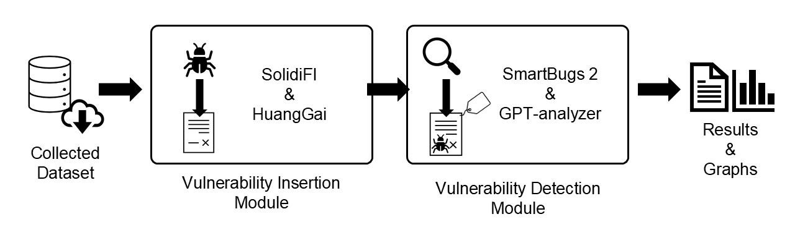
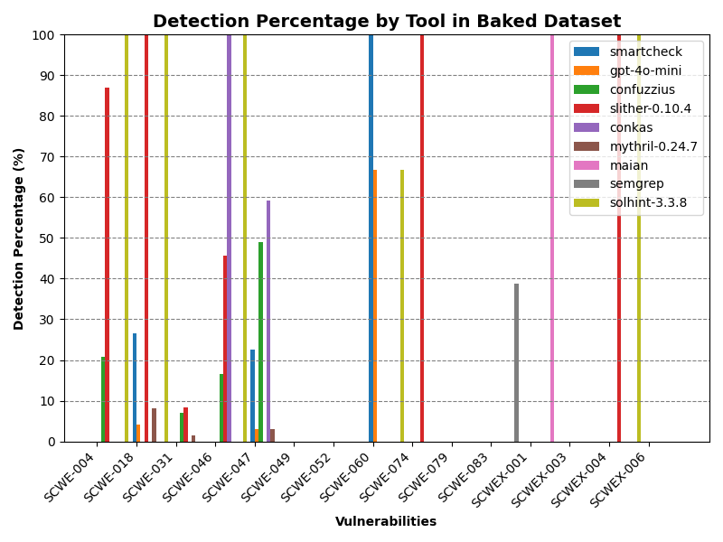
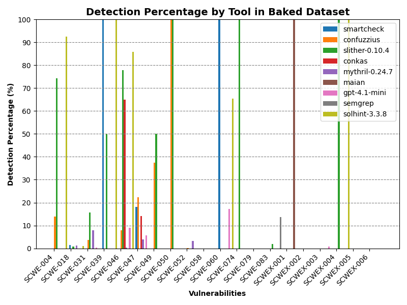

<div style="text-align: justify"> 

<h1>VulLab</h1>

We present VulLab, a validation framework for vulnerability detection tools with support to Solidity source code. Our application enables users to add vulnerabilities to a collection of smart contracts, extract their respective labels and readily use them as a benchmark for several bug detector. This repository is related to the paper "*Building a Labeled Smart Contract Dataset for Evaluating Vulnerability Detection Tools’ Effectiveness*", currently under evaluation for publishing in SBSeg2025's Tools Session (Salão de Ferramentas). The work's abstract goes as follows:

*In recent years, surveys on vulnerability detection tools for
Solidity-based smart contracts have shown that many of them display poor
capabilities. One of the causes for such deficiencies is the absence of quality benchmarking datasets, where bugs typically found in smart contracts are present in quantity and accurately labeled. VulLab’s main aim is to help tackle this issue as a framework that incorporates both, state-of-the-art vulnerability insertion and vulnerability detection tools. Such capabilities empower users to seamlessly generate benchmark capable datasets from collected contracts and employ them to validate novel analysis tool and obtain an accurate comparison with current state-of-the-art solutions. The framework was able to, from 50 smart contracts collected from the Ethereum mainnet, generate an annotated dataset more than 300 entries which included 20 unique vulnerabilities, and use them to compare 14 analysis tools in approximately 24 hours. VulLab is open-source and is available at https://github.com/lsRyan/vullab.*


## Table of Contents
- [Table of Contents](#table-of-contents)
- [Basic Information](#basic-information)
- [Quick Start](#quick-start)
- [Dependencies](#dependencies)
- [Installation](#installation)
- [Usage](#usage)
- [Test and Experiments](#test-and-experiments)
- [Information for Artefact Analysis](#information-for-artefact-analysis)
- [Demo (In portuguese)](#demo-in-portuguese)
- [License](#license)

Each of the sections above corresponds to the following:

- **Basic Information**: Introduction of VulLab's capabilities and architecture
- **Quick Start**: Virtual Machine for rapid execution of VulLab
- **Dependencies**: Presentation of the dependencies needed to execute VulLab
- **Installation**: Step-by-step guide of how to install VulLab
- **Usage**: Manual of how to use each of VulLab's functionalities
- **Test and Experiments**: Step-by-step guide for the execution of tests
- **Information for Artefact Analysis**: Required seals and objective claims
- **Demo**: Video with an example of VulLab using the provided virtual machine
- **License**: Project license


## Basic Information
VulLab is a vulnerability detection tools validation framework specialized in Solidity-based smart contracts which combines three important state-of-the-art research works. Its implementation brings together bug insertion capabilities and vulnerability detectors automatic execution and benchmarking. The main objective of our application is to empower developers to easily obtain and use an annotated dataset in order to test their detection tools still in development and rapidly obtain a comparison between the novel solution and te current state-of-the-art capabilities.

For the addition of bugs to collected smart contracts, VulLab is powered by two of the foremost insertion applications for Solidity source code: [SolidiFI](https://github.com/DependableSystemsLab/SolidiFI) and [HuangGai](https://github.com/xf97/HuangGai). The supported versions for them are `pragma version 0.5.0^` and `pragma version 0.7.0^` respectively. VulLab enhances these tools' usability by executing them in a seamless automatic multi-threading mode. Besides, the inserted contracts and labels are standardized to SolidiFI's robust CSV format and directly matched with the [Smart Contract Vulnerability Weakness Enumeration (SCWE)](https://scs.owasp.org/SCWE/) entry deemed closest to each of them. In the cases were no SCWE match was deemed reasonable, we defined our own extension to the enumeration, named SCWEX. The integration of insertion mechanisms was specifically designed with modularity in mind, enabling an easy way to add new tools to this framework as they are developed.

As for the execution of state-of-the-art vulnerability analysis tools, our framework employs [SmartBugs](https://github.com/smartbugs/smartbugs), which enables the parallelization of containerized tools. Its modularity makes it a perfect choice for VulLab, as it can be easily extended by following [the extension tutorial](https://github.com/smartbugs/smartbugs/wiki/Adding-new-analysis-tools) in its [wiki](https://github.com/smartbugs/smartbugs/wiki) page, thus enabling developers to add their newly developed tool to effortlessly obtain a comparison with other stat-of-the-art analyzers. The results obtained by running the analysis are automatically compiled into `results/summary.csv`, which is used for comparison with the vulnerability labels.

Besides `SmartBugs2`, VulLab's vulnerability analysis module also includes a simple GPT-based LLM detection solution. It was implemented as an API call which uses a specially crafted system prompt instructing the model to act as an analysis tool. Importantly, in context learning was employed to ensure that the adopted report standard, Sarif 2.1.0, is followed and that the detected tools are named by the SCWE standard.

The image bellow offers an overview of the described process:

<p align="center">
  
</p>

An in-depth explanation of Vullab's implementation can be found in the [Technical Details page](docs/Technical_Details.md).

**Note: There are no relevant safety and security concerns in regard to the installation and usage of VulLab.**


## Quick Start
To test VulLab in a custom build environment with all required dependencies and datasets for undertaking both the [smoke test](#smoke-test-minimum-test) and [complete test](#reduced-experiment), please download the provided virtual machine (~20Gb) on the link below. It is the same one used in the [demo video](#demo-in-portuguese)!

[![Button]][VM_Link]

[Button]: https://img.shields.io/badge/Download_VM-37a779?style=for-the-badge
[VM_Link]: https://onedrive.live.com/?redeem=aHR0cHM6Ly8xZHJ2Lm1zL3UvYy9iNTIzMTNhYmUwNDEzNWUwL0ViRXVaQUNNT2VoTm9wdmVLOHVtQWRnQlg5Ukt1VnNiSXJjLTVHS01OR1ROOUE%5FZT1vdUo1cDM&cid=B52313ABE04135E0&id=B52313ABE04135E0%21s00642eb1398c4de8a29bde2bcba601d8&parId=B52313ABE04135E0%21s62b3d90c0ae74b9cb25800075efe928c&o=OneUp


## Dependencies
VulLab was made for Linux systems and was not tested in Windows or MacOS. Its main dependencies are presented in this section.


<h3>Docker</h3>

We recommend using `Docker` version 28.3.3. To install it, follow [Docker's installation tutorial](https://docs.docker.com/engine/install/ubuntu/). Make sure to add your user to `Docker`'s group to allow VulLab to use it! You can achieve that by executing 

```
sudo usermod -a -G docker $USER
```

Please refer to `Docker`'s [documentation](https://docs.docker.com/manuals/) for more information.


<h3>Python</h3>

We recommend using `python version 3.13`. Make sure you have this version installed or get it by typing

```
apt-get install python3.13
```


<h3>SmartBugs</h3>

`SmartBugs` is also needed to execute the analysis of smart contracts by vulnerability detection tools. It will be automatically installed once it is required for VulLab, thus requiring no manual installation.

If you instead opt for a manual installation, please note that you should undertake the following steps only **after** [installing VulLab](#installation). 

First, clone its repository into `/vullab` with the following command:

```
git clone https://github.com/smartbugs/smartbugs
```

Then, install the provided virtual environment by typing

```
cd smartbugs
install/setup-venv.sh
```

For more information on `SmartBugs` installation please refer to its [installation tutorial](https://github.com/smartbugs/smartbugs/blob/master/doc/installation.md). The repository's [wiki](https://github.com/smartbugs/smartbugs/wiki) page also contains helpful information regarding the tool's installation, usage and extension.


<h3>Pip packages</h3>

VulLab requires several `pip` libraries to work, which are listed into [vullab_env.yml](vullab_env.yml) or [requirements.txt](requirements.txt). For a complete dependencies overview you can also refer to the [dependencies table](docs/Dependencies_Table.md).


## Installation
First, clone VulLab in the directory you wish it to be located

```
git clone https://github.com/lsRyan/vullab.git
```

Then enter the cloned directory by executing

```
cd vullab
```

For manually installing all of the required packages we offer two alternatives: one requiring `miniconda`, a free environment managing tool, and another which only requires a system with `python`.


<h3>Using Miniconda (recommended)</h3>

This option requires `miniconda`, of which we recommend version 24.7.1. It can be obtained by following [miniconda's installation tutorial](https://www.anaconda.com/docs/getting-started/miniconda/install). **Note that this installation may require a system reboot to take effect**.

Once `miniconda` is installed, import the provided environment by executing

```
conda env create --file vullab_env.yml
```

To access the newly created environment just type

```
conda activate vullab
```


<h3>Using pip (not recommended)</h3>

Alternatively you can install all the requirements manually in a virtual environment of your choice or in your main system. Before choosing this option we invite you to reconsider using `miniconda` as it enables you to use the provided specifically configured environment for VulLab, thus reducing the possibility of any issues.

First, make sure `pip` is installed by executing

```
python -m ensurepip --upgrade
```

Then, install VulLab's dependencies in your environment by typing

```
pip install -r requirements.txt
```


## Usage
VulLab's user interface is implemented as a simple terminal command line as follows:

```
vullab.sh [--threads THREADS] [--cpus CPUS]
          [--solidifi] [--huanggai TIMEOUT]
          [--analyze QUANTITY] [--gpt QUANTITY MODEL] 
          [--match-window MATCH_WINDOW] [--build] 
          [--help]
```

For more information about each configuration please refer to the [usage manual](/docs/Usage_Manual.md) or to the built in help menu by typing `bash vullab.sh -h` after installation.


## Test and Experiments
VulLab includes two test datasets to illustrate its core functionalities, namely `raw_dataset_5`, for the [smoke test](#smoke-test-minimum-test), and `raw_dataset_50`, for the [reduced experiment](#reduced-experiment). The later consists of fifty carefully curated smart contracts that enable the observation of all of our framework's (which is also the dataset used in our published paper) features while the former is a subset containing only five entries for a fast verification.

We also undertook a larger study that included thousands of files, leading to insights on the performance of current state-of-the-art vulnerability detection tools (e.g., which tools excelled or fell short in specific vulnerabilities). You can read about it in the [complete experiment report](/docs/Complete_Experiment.md). Importantly, due to the stringent requirements of executing this experiments, **we request that the reduced experiment be considered for Seals' evaluation purposes, as its resource demands are impractical for standard assessments.**


<h3>Before running the experiments</h3>

- **If you are using the provided VM**, note that you will find VulLab's installation in `home/Documents`. Hence, you should follow the steps presented in the test and experiments below in that location. The `vullab` directory in the Desktop contain the **results obtained in the demo**. Importantly, if you get any error related to disk space (which should not happen) you can safely delete the Desktop directory.

- It is important to note that large language models (LLMs) inherently exhibit probabilistic behavior, which may lead to variability in GPT-based results across different executions.

- We strongly recommend watch the [demo](#demo-in-portuguese) before executing, as it presents a step-by-step execution of the [reduced experiment](#reduced-experiment).

<h3>Smoke test (Minimum test)</h3>
To execute the smoke test copy all contents from the `dataset\raw_dataset_5` to the `dataset\raw_dataset` (you may need to manually delete the `.gitkeep` file in `dataset\raw_dataset`). With the command line open in the project's root directory execute:

```
bash vullab.sh --smoke-test
```

The command above will automatically configure VulLab to run the following command:

```
bash vullab.sh -t 8 -s -u -a -g gpt-4o-mini
```

Note that, if you are running this test manually (cmd above) and you do not have an OpenAI API key, you should omit the `-g gpt-4o-mini` portion of the command.

After executing, the output should be as follows:

<p align="center">
  
</p>

<h3>Reduced Experiment</h3>
To execute the reduced experiment copy all contents from `dataset\raw_dataset_50` to `dataset\raw_dataset` (you may need to manually delete the `.gitkeep` file in `dataset\raw_dataset`). With the command line open in the project's root directory execute:

```
bash vullab.sh --reduced-experiment
```

The command above will automatically configure VulLab to run the following command:

```
bash vullab.sh -t 8 -s -u 0.25 -a -g -m 3
```

Note that, if you are running this test manually (cmd above) and you do not have an OpenAI API key, you should omit the `-g` portion of the command.


After executing, the output should be as follows:

<p align="center">
  
</p>

## Information for Artefact Analysis
With the smoke test and reduced experiment we would like to request the evaluation of all of the Quality Seals, namely Open Source Artifact (SeloD), Functional Artefact (SeloF), Sustainable Artefact (SeloS), and Reproducible Experiments (SeloR).

Our main claims are the following:

 - **Claim 1**: VulLab makes it possible to seamlessly create a high quality benchmark-capable dataset with 200+ entries in a somewhat reasonable amount of time (24 hours) only requiring a collection of collected contracts. It includes 20 different kinds of vulnerabilities, all mapped to SCWE, and have all their inserted vulnerabilities accurately labeled in clear, easy to read labels. Note that **only inserted vulnerabilities** are labeled. Other pre-existent bugs are not considered.

- **Claim 2**: The generated dataset can be easily employed to benchmark several vulnerability detection tools and obtain an intuitive comparison graph. In addition, user can seamlessly add their newly developed vulnerability detection tools to test them against state-of-the-art solution.


## Demo (In portuguese)
A video with a demo of Vullab using the `raw_dataset_50` is accessible as an [unlisted video](https://www.youtube.com/watch?v=IMw2kVApL3g).


## License
This work and all the files developed by us are licensed under [BSD 3-Clause License](LICENSE). Note that each smart contract (every .sol file) has its own unique license, which can be seen as a comment in the first lines of the script. The most common licenses for smart contracts are GPL-3.0 and MIT licenses.

</div>